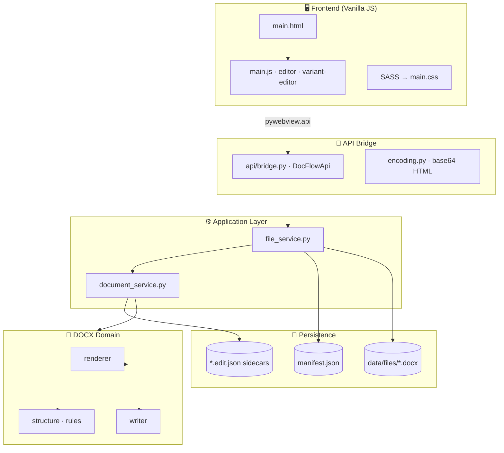
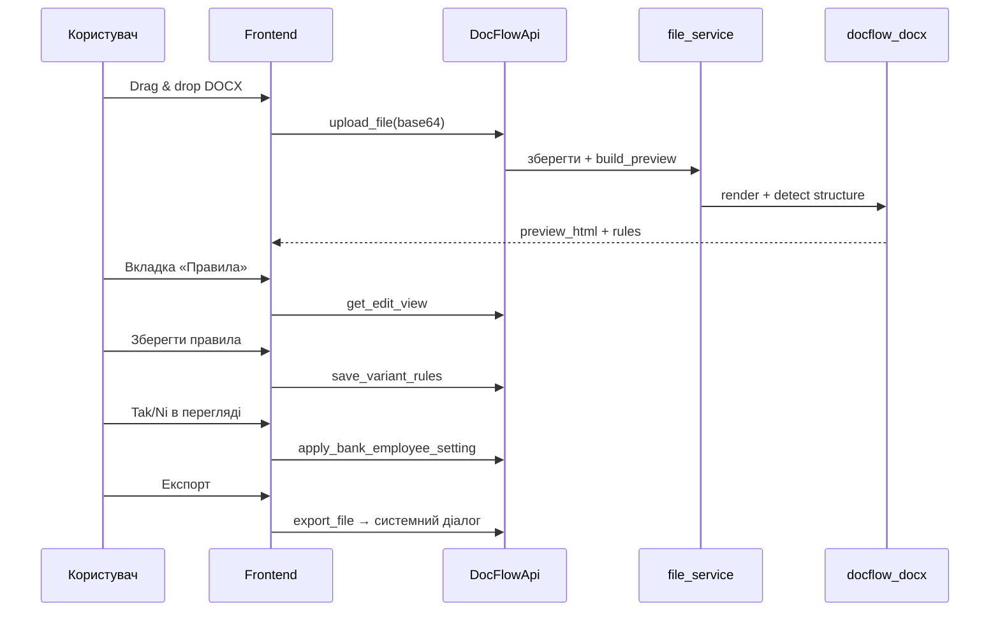

<div align="center">

# DocFlow

**Десктопний робочий простір для договірних документів**

Перегляд, редагування та керування варіантами в DOCX · TXT · PDF

<br/>

[](https://www.python.org/)
[](https://pywebview.flowrl.com/)
[](https://python-poetry.org/)
[](https://github.com/)

<br/>

[Можливості](#-можливості) ·
[Швидкий старт](#-швидкий-старт) ·
[Архітектура](#-архітектура) ·
[Структура проєкту](#-структура-проєкту) ·
[Розробка](#-розробка)

</div>

---

## ✨ Про застосунок

**DocFlow** — це локальний desktop-застосунок для роботи з юридичними та договірними документами. Він поєднує зручний перегляд Word-файлів у браузерному UI з потужною логікою **варіантів договору**: підпункти, умови (Так/Ні) та правила, які визначають, який текст потрапляє у фінальний документ.

Застосунок працює **повністю локально** — файли зберігаються на диску, без хмари та зовнішніх API.

<table>
<tr>
<td width="50%" valign="top">

### 🎯 Для чого

- Швидко відкривати та переглядати DOCX / TXT / PDF
- Редагувати текст прямо в перегляді (Word-like ribbon)
- Налаштовувати **варіанти** договору за умовами
- Експортувати готовий документ через системний діалог

</td>
<td width="50%" valign="top">

### 💡 Особливість

DocFlow розуміє **червоний текст** і структуру «варіантів» у DOCX, будує дерево підпунктів і дозволяє прив’язати кожен варіант до умови — наприклад, *«Позичальник є працівником банку»* → **Так / Ні**.

</td>
</tr>
</table>

---

## 🚀 Можливості

| | Функція | Опис |
|:---:|:---|:---|
| 📄 | **Підтримка форматів** | DOCX (повний pipeline), TXT, PDF (embed-перегляд) |
| ✏️ | **In-place редагування** | Contenteditable + панель форматування для DOCX/TXT |
| 🔀 | **Варіанти договору** | Автовизначення підпунктів, призначення блоків, Tak/Ni |
| 📋 | **Панель правил** | Створення правил, згортання блоків, kebab-меню |
| 👁️ | **Перегляд з умовами** | Boolean-картки для швидкого перемикання сценаріїв |
| 📁 | **Менеджер файлів** | Drag & drop, пошук, sidebar з типами файлів |
| 💾 | **Експорт** | Збереження через нативний діалог ОС |
| 🌓 | **Теми** | Світла / темна тема з localStorage |
| ⏳ | **Progress UI** | Ненав’язливі progress bar при upload / export |
| 🎬 | **Splash screen** | Анімована заставка при запуску |

---

## 🖥️ Інтерфейс

```
┌─────────────────────────────────────────────────────────────────┐
│  DocFlow   /  document.docx                    [ СВІТ │ ТЕМН ]  │
├──────────────┬──────────────────────────────────────────────────┤
│  Документи   │  document.docx   [ Перегляд │ Правила ]  Зберегти│
│              ├──────────┬───────────────────────────────────────┤
│  [ Upload ]  │ Умови    │                                       │
│              │ Tak / Ni │     📄 Документ (editable preview)    │
│  🔍 Пошук    │          │                                       │
│              │          │                                       │
│  • file.docx │          │                                       │
│  • file.pdf  │          │                                       │
└──────────────┴──────────┴───────────────────────────────────────┘
│  ● Готово                                              UTF-8   │
└─────────────────────────────────────────────────────────────────┘
```

> **Перегляд** — документ + панель умов (якщо налаштовані правила)  
> **Правила** — дерево правил, підпунктів і варіантів зліва від документа

---

## ⚡ Швидкий старт

### Вимоги

- **Python 3.12+**
- [Poetry](https://python-poetry.org/docs/#installation) (рекомендовано) або `pip`

### Встановлення

```bash
git clone https://github.com/your-username/docflow.git
cd docflow
poetry install
```

### Запуск

```bash
cd app
poetry run python main.py
```

Або без Poetry:

```bash
cd app
pip install python-docx pywebview beautifulsoup4
python main.py
```

При першому запуску з’явиться **splash screen** з анімацією лого, потім — основний інтерфейс.

---

## 🏗️ Архітектура



### Шари backend

| Шар | Призначення |
|:---|:---|
| `api/` | RPC-міст до JavaScript, кодування HTML, діалог експорту |
| `services/` | Use cases: upload, preview, save, rules |
| `repositories/` | Manifest і файлове сховище |
| `docflow_docx/` | Рендер DOCX→HTML, структура варіантів, round-trip write |

---

## 📂 Структура проєкту

```
docflow/
├── app/
│   ├── main.py                 # Точка входу (pywebview)
│   ├── config.py               # Шляхи та константи
│   ├── api/                    # JS ↔ Python bridge
│   ├── services/               # Бізнес-логіка
│   ├── repositories/           # manifest.json, файли на диску
│   ├── docflow_docx/           # DOCX pipeline
│   ├── resources/
│   │   ├── html/main.html
│   │   ├── js/                 # UI, editor, splash, loading
│   │   └── sass/partials/      # Модульні стилі
│   └── data/
│       ├── manifest.json
│       └── files/              # Завантажені документи + sidecars
├── pyproject.toml
└── README.md
```

### Sidecar `.edit.json`

Поруч із кожним DOCX зберігається `{uuid}.docx.edit.json`:

```json
{
  "html": "...",
  "source_html": "...",
  "settings": { "is_bank_employee": true },
  "variant_rules": {
    "conditions": [...],
    "rules": [...],
    "subpoints": [...],
    "rule_items": [...]
  }
}
```

---

## 🛠️ Технології

<table>
<tr>
<td align="center" width="120"><strong>Backend</strong></td>
<td>


</td>
</tr>
<tr>
<td align="center"><strong>Frontend</strong></td>
<td>


</td>
</tr>
<tr>
<td align="center"><strong>Storage</strong></td>
<td>


</td>
</tr>
</table>

---

## 🔄 Типовий workflow



---

## 🧑‍💻 Розробка

### Компіляція стилів

```bash
npx sass app/resources/sass/main.sass app/resources/sass/main.css
```

### Структура JS

| Файл | Роль |
|:---|:---|
| `main.js` | Контролер: tabs, upload, save, export |
| `editor.js` | Word-like ribbon, contenteditable |
| `variant-editor.js` | UI правил і варіантів |
| `splash.js` | Анімація запуску |
| `loading.js` | Progress bar (upload / export) |
| `core/api-client.js` | pywebview API, base64 codec |

### Запуск з `app/` як робочої директорії

Python-модулі імпортуються відносно папки `app/` — запускайте **`main.py` саме звідти**.

---

## 📌 Статус проєкту

> **v0.1.0** — активна розробка. Основний функціонал (upload, preview, rules, export) реалізовано.

- [x] Завантаження DOCX / TXT / PDF
- [x] Редагування та збереження
- [x] Система правил і варіантів
- [x] Splash screen і progress UI
- [x] Світла / темна тема
- [ ] Автотести для DOCX pipeline
- [ ] Інсталятор / packaged build

---

<div align="center">

<br/>

**DocFlow** · локальний document workflow для професійної роботи з договорами

<br/>

<sub>Створено Oleksii Kulinets · kulinets.oleksii@gmail.com</sub>

<br/><br/>

⭐ Якщо проєкт корисний — поставте зірку на GitHub

</div>
